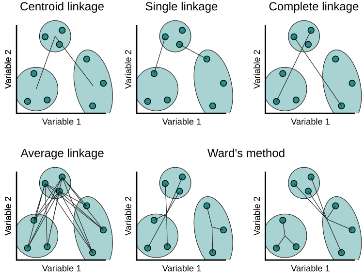

<p style="margin:0!important; user-select: none;"></p>
```{r include=FALSE}
source('settings/setup.R')
source('settings/plots_style.R')
```

```{r echo=F}
par(bg="#14141400",
    fg="white",
    col="white",
    col.axis="white",
    col.lab="white",
    col.main="white",
    col.sub="white"
)
```


<h3>Descrição do estudo</h3>

Para cada indivíduo pertencente ao estudo, foram amostrados genes individuais e realizada a medição da intensidade da luz em cima de cada um deles. O banco de dados disponibilizará os valores dessa intensidade individualmente para cada gene de cada indivíduo.

# Problema

Com base no banco de dados, queremos verificar se existe alguma relação entre esses  valores da intensidade da luz em cima de cada gene com características pessoais de cada indivíduo.

# Proposta 

Para a resolução do problema, agruparemos os genes pelo valor da intensidade de luz e utilizaremos a informação mútua vista em aula para checarmos se os genes introduzidos em cada cluster possuem distribuição parecida ou não. Após essa checagem, será feita uma distribuição única da intensidade de luz para cada cluster e a mesma será utilizada para caracterizar cada conjunto de cluster em relação às características do indivíduo.

## Roteiro

- Análise descritiva de todos indivíduos do estudo;
- Sintetização do conjunto de genes que apresentam intensidade de luz semelhantes pareadas por indivíduos, agrupando por similaridade através de técnica de agrupamento hierárquico;
- Observar a consistência entre os genes agrupados e as intensidades de luz apresentada para cada indivíduo;
- Unificar a distribuição de intensidade de luz contida em cada grupo de genes;
- Identificar se há possibilidade de discriminar os níveis de cada variável característica do conjunto de indivíduos, podendo concluir quais grupos de genes têm relação com cada característica.

## Código

```{r}
# Carregando pacotes
library(tidyverse)
library(dplyr)
library(cluster)
library(infotheo)
library(stringr)
library(patchwork)
```

### Conjunto de dados

```{r}
load("glioma.RData") # geneInfo ; gliomaGSE52009 ; targetInfoGlioma
glioma <- gliomaGSE52009; as.data.frame(glioma)
info <- targetInfoGlioma; rownames(info) <- NULL; info |> select(colnames(info[,-1]),FileName)
```

```{r}
str(info[,-1]) # ignorando a coluna FileName
info$gender <- factor(info$gender); levels(info$gender)
```

```{r, class.source = 'fold-hide'}
ggplot(info, aes(x=reorder(gender, -table(gender)[gender])))+
  geom_bar(aes(fill=gender), color="transparent")+
  scale_fill_manual(values=c(male="#3E67A3",female="#A34336",unknown="#7F8F85"))+
  geom_text(stat = 'count', aes(label = paste0(round((after_stat(count)/sum(after_stat(count)))*100), "%")), vjust = -0.5) +
  scale_y_continuous(expand = expansion(mult=c(0,.2)))+
  labs(x=NULL,y=NULL, title="Gênero")+
  guides(fill="none")
```

```{r}
info$diagnostic <- factor(info$diagnostic); levels(info$diagnostic)
```

```{r, class.source = 'fold-hide'}
ggplot(info, aes(x=reorder(diagnostic, -table(diagnostic)[diagnostic])))+
  geom_bar(aes(fill=diagnostic), color="transparent")+
  scale_fill_grey(end = 0.9, start=.5)+
  geom_text(stat = 'count', aes(label = paste0(round((after_stat(count)/sum(after_stat(count)))*100), "%")), vjust = -0.5) +
  scale_y_continuous(expand = expansion(mult=c(0,.15)))+
  labs(x=NULL,y=NULL, title="Diagnóstico")+
  theme(axis.text.x = element_text(angle = 45,hjust = 1, vjust=1))+
  guides(fill="none")
```

```{r}
range(info$age)
cat(paste0(sum(info$age<=0)," entradas inválidas para idade  => ",round(sum(info$age<=0)/nrow(info)*100,2), "% da amostra")) # Porcentagem de dados inválidos para idade
range(info[which(info$age>0),]$age)
```

```{r, class.source = 'fold-hide'}
ggplot(subset(info[which(info$age>0),]), aes(x = age, y = after_stat(density))) +
  geom_histogram(aes(y = ..density..), fill = "skyblue", color = "#0c0c0c", binwidth = 5, alpha = 0.9) +
  geom_density(color = "cyan", linetype = "solid", linewidth = 1, fill="transparent") +
  labs(x = "Idade", y = "Frequência relativa", subtitle ="(somente dados válidos)", title="Distribuição de idade na amostra")+
  scale_y_continuous(expand = expansion(mult=c(0,.20)))+
  scale_x_continuous(n.breaks = 20)
```

```{r}
unique(info$datasetId)
unique(info$tissue)
```

### Agrupamento dos genes

Aplica-se um agrupamento hierárquico para simplificar conjunto de genes que apresentam mesma intensidade de luminosidade para cada indivíduo. Dessa forma, e levando em consideração que os dados são coletados sob a mesma medida, opta-se por não padronizá-los. Caso fossem padronizados, algumas intensidades não expressivas poderiam ser conectadas com outras mais expressivas originalmente (quando considerados os valores não padronizados).

```{r, echo=F, eval=F}
custom_dist <- function(x, y) exp((x-y)**2) # penaliza mais para grandes erros

d <- proxy::dist(glioma[,1], method=custom_dist)
for(i in 2:ncol(glioma)){
  d <- d + proxy::dist(glioma[,i], method=custom_dist)
}
```

```{r}
d <- dist(glioma, method = "euclidean")
```


Para a junção dos clusters, tem-se algumas ordens de hierarquização, tais quais:

<div style="display: flex; justify-content: center;padding:10px">

</div>

- *Single linkage*: É a distância mais curta entre quaisquer dois pontos nos dois grupos.

- *Complete linkage*: É o oposto do single linkage. É a distância mais longa entre quaisquer dois pontos nos dois grupos.

- *Average linkage*: É a média das distâncias entre cada ponto de um grupo para todos os pontos do outro grupo.

- *Centroid linkage*: A distância entre o ponto central de um grupo ao ponto central do outro grupo.

- *Ward's linkage*: Uma combinação dos métodos average e centroid. A variância dentro do grupo é calculada determinando o ponto central do grupo e a distância das observações em relação ao centro. Ao tentar mesclar dois grupos, a variância é calculada entre os grupos e os grupos são mesclados se sua variância for menor em comparação com outras combinações.


```{r}
hc<-hclust(d, method = "ward.D") # Hierarchical Cluster com linkage por Ward.D
num_cluster_init <- 20; init_clusters = cutree(hc, num_cluster_init) # pegando os clusters iniciais 
```

```{r}
# Exemplo do um cluster selecionado inicialmente
as.data.frame(glioma[which(init_clusters==1),])
```

```{r}
genes.clusters <- list()
for(clust in 1:num_cluster_init){
  gp <- glioma[which(init_clusters==clust),] # selecionando o cluster
  
  if(is.null(nrow(gp))) {
    next
  } else{
    bounds <- apply(gp,MARGIN = 2, FUN = function(x) quantile(x,c(0.15,0.85))) # definindo os intervalos interquantil para cada indivíduo nesse conjunto de genes
    
    # identificando cada intensidade dentro do cluster se está dentro do interquantil do indíviduo
    in_bound <- as.data.frame(lapply(1:ncol(gp), FUN= function(i) {as.numeric(between(gp[,i],bounds[1,i],bounds[2,i]))})); colnames(in_bound) <- colnames(bounds); rownames(in_bound) <- rownames(gp)
    
    # manter no cluster apenas os genes que se apresentaram bastante no todo da amostra dentro do intenquartil da intensidade de cada indivíduo 
    select_genes <- apply(in_bound, MARGIN = 1, function(x) sum(x)) >= 0.7*ncol(glioma)
    select_names <- names(which(select_genes==T))
    if(length(select_names)>1){
      genes.clusters <- append(genes.clusters,list(select_names))
    }
  }
}

for(i in 1:length(genes.clusters)){
  if(i==1) cat("--- Genes:\n")
  cat(paste0("\nCluster ",i,":\n"))
  cat(genes.clusters[[i]],sep=" | ")
  cat("\n")
}
```

### Distribuição unificada por cluster

Agora que os genes já foram agrupados por similaridade, visualiza-se o valor da informação mútua entre e intra os grupos com os genes selecionados. Para isso, será necessário discretizar as entradas para então obter as distribuições empirícas de cada gene.

<https://search.r-project.org/CRAN/refmans/infotheo/html/multiinformation.html>

```{r}
breaks <- seq(floor(min(glioma)), ceiling(max(glioma)), by=1) # definindo intervalos para discretizar

mutualinfo_clust <- list()
for(clust in 1:length(genes.clusters)){
  cluster_disc_temp <- apply(glioma[genes.clusters[[clust]],], MARGIN = c(1,2),function(x) cut(x, breaks)) # discretizando cluster
  
  mutualinfo_clust <- append(mutualinfo_clust,multiinformation(t(cluster_disc_temp))) # Correlação Total (em nats - quando usado logaritmo natural para entropia)
}

for(i in 1:length(genes.clusters)){
  if(i==1) cat("--- Informação Mútua (em nats):\n")
  cat(paste0("\nCluster ",i,":\t ",format(round(mutualinfo_clust[[i]],2),width = 6, nsmall = 2)))
}
```

```{r}
ind_bound <- max(quantile(unlist(mutualinfo_clust),0.25)[[1]],1); ind_bound # métrica para clusters consistentes

clusters_consistentes <- which(mutualinfo_clust<ind_bound); clusters_consistentes # Clusters consistentes (com distribuição de intensidade luminosa similar)
```
```{r}
df_consistentes <- data.frame()
for(clust in clusters_consistentes){
  # definindo a mediana das intensidades luminosas para cada indivíduo da amostra considerando todos genes do cluster
  cluster_dist <- apply(glioma[genes.clusters[[clust]],], MARGIN=2, FUN= function(x) median(x)) 
  df_consistentes <- rbind(df_consistentes, data.frame(t(cluster_dist), row.names = clust))
}

# distribuições das intensidades lumninosas unificada por cluster
df_consistentes
```

### Discriminação de características

Tem-se 3 características de cada indívíduo disponibilizadas conforme visto na seção de apresentação do conjunto de dados: gênero, idade e diagnóstico. Com isso, verifica-se se há distinção da distribuição de cada nível de tais características por cluster de genes consistentes obtidos anteriormente.

Contudo, inicialmente, é realizado um breve tratamento nos dados: para a análise dos níveis de gênero, desconsidera-se as entradas como "*unknow*"; além disso, categoriza-se a idade, e despreza-se os dados com entrada inválida como idade negativa; por fim, para a informação sobre diagnóstico, separa-se em 6 diagnósticos já apresentados, e em dois tipos - anaplástico e plástico.

Dessa forma, para cada cluster, tem-se a visualização da distribuição da luminosidade para esses diferentes grupos, e espera-se identificar clusters que discriminizam bem alguma característica.

```{r}
valid_gender <- info |> filter(gender != "unknown") |> select(id = geoAccession, gender)

valid_age <- info |> filter(age > 0) |> select(id = geoAccession, age)
valid_age$cat_age <- cut(valid_age$age, breaks = c(0,7,14,20,30,40,50,60,70,80,100))

valid_diag <- info |> select(id = geoAccession, diagnostic) |> 
  mutate(diag_type = case_when(
    str_detect(diagnostic, "anaplastic") ~ "anaplastic",
    TRUE ~ "plastic"
    )
  )
```

```{r, class.source = 'fold-hide', results='asis', out.width="80%", fig.asp=3/7}
for(clust in clusters_consistentes){
  meio_p1 <- sum(range(df_consistentes[as.character(clust),valid_gender$id]))/2
  med_p1 <- median(unlist(df_consistentes[as.character(clust),valid_gender$id]))
  leg_dir_p1 <- ifelse(med_p1<meio_p1, 1, 0)
  
  p1 <- data.frame(int_luz = unlist(df_consistentes[as.character(clust),valid_gender$id]), gender = valid_gender$gender) |> 
    ggplot(aes(x = int_luz, fill = factor(gender), color=factor(gender))) +
    geom_density(alpha = 0.2) + 
    scale_fill_manual(values = c(male="#1775ff",female="#ff371c"), name=NULL)+
    scale_color_manual(values = c(male="#1775ff",female="#ff371c"), name=NULL)+
    scale_y_continuous(expand = expansion(mult=c(0,.10)))+
    scale_x_continuous(expand= c(0,0))+
    theme(legend.position = c(leg_dir_p1,1), legend.justification = c(leg_dir_p1,1), legend.background = element_rect(fill = "#00000050"), plot.title = element_text(hjust=0), legend.key = element_rect(color="transparent", fill="transparent"))+
    labs(x= "Intensidade luminosa", y="Densidade", title="Gênero")
  
  meio_p2 <- sum(range(df_consistentes[as.character(clust),valid_age$id]))/2
  med_p2 <- median(unlist(df_consistentes[as.character(clust),valid_age$id]))
  leg_dir_p2 <- ifelse(med_p2<meio_p2, 1, 0)
  
  p2 <- data.frame(int_luz = unlist(df_consistentes[as.character(clust),valid_age$id]), age = valid_age$cat_age) |> 
    ggplot(aes(x = int_luz, fill = factor(age), color=factor(age))) +
    geom_density(alpha = 0.2)+
    scale_fill_discrete(name=NULL)+
    scale_color_discrete(name=NULL)+
    scale_y_continuous(expand = expansion(mult=c(0,.10)))+
    scale_x_continuous(expand= c(0,0))+
    theme(legend.position = c(leg_dir_p2,1), legend.justification = c(leg_dir_p2,1), legend.background = element_rect(fill = "#00000050"), plot.title = element_text(hjust=0), legend.key = element_rect(color="transparent", fill="transparent"))+
    labs(x= "Intensidade luminosa", y="Densidade", title="Faixa etária")
  
  meio_p34 <- sum(range(df_consistentes[as.character(clust),valid_diag$id]))/2
  med_p34 <- median(unlist(df_consistentes[as.character(clust),valid_diag$id]))
  leg_dir_p34 <- ifelse(med_p34<meio_p34, 1, 0)
  
  p3 <- data.frame(int_luz = unlist(df_consistentes[as.character(clust),valid_diag$id]), diagnostic = valid_diag$diagnostic) |> 
    ggplot(aes(x = int_luz, fill = factor(diagnostic), color=factor(diagnostic))) +
    geom_density(alpha = 0.2) + 
    guides(fill=guide_legend(title=NULL), color=guide_legend(title=NULL))+
    scale_y_continuous(expand = expansion(mult=c(0,.10)))+
    scale_x_continuous(expand= c(0,0))+
    theme(legend.position = c(leg_dir_p34,1), legend.justification = c(leg_dir_p34,1), legend.background = element_rect(fill = "#00000050"), plot.title = element_text(hjust=0), legend.key = element_rect(color="transparent", fill="transparent"))+
    labs(x= "Intensidade luminosa", y="Densidade", title="Diagnóstico")
  
  p4 <- data.frame(int_luz = unlist(df_consistentes[as.character(clust),valid_diag$id]), diagnostic = valid_diag$diag_type) |> 
    ggplot(aes(x = int_luz, fill = factor(diagnostic), color=factor(diagnostic))) +
    geom_density(alpha = 0.2) + 
    scale_fill_manual(values=c("anaplastic"="#5ed19f","plastic"="#c753f5"))+
    scale_color_manual(values=c("anaplastic"="#5ed19f","plastic"="#c753f5"))+
    guides(fill=guide_legend(title=NULL), color=guide_legend(title=NULL))+
    scale_y_continuous(expand = expansion(mult=c(0,.10)))+
    scale_x_continuous(expand= c(0,0))+
    theme(legend.position = c(leg_dir_p34,1), legend.justification = c(leg_dir_p34,1), legend.background = element_rect(fill = "#00000050"), plot.title = element_text(hjust=0), legend.key = element_rect(color="transparent", fill="transparent"))+
    labs(x= "Intensidade luminosa", y="Densidade", title="Tipo de diagnóstico")
  
  ptot1 <- p1+p2+plot_layout(ncol = 2) & theme(
  panel.border = element_blank(),
  panel.grid.major = element_blank(),
  panel.grid.minor = element_blank(),
  plot.background = element_rect(fill="#0c0c0c", color="#0c0c0c"),
  text = element_text(size=8)
  )
  
  ptot2 <- p3+p4+plot_layout(ncol = 2) & theme(
  panel.border = element_blank(),
  panel.grid.major = element_blank(),
  panel.grid.minor = element_blank(),
  plot.background = element_rect(fill="#0c0c0c", color="#0c0c0c"),
  text = element_text(size=8)
  )
  
  cat("<pre>--- Cluster ", clust, ":</pre>","\n")
  cat("\n")
  print(ptot1)
  print(ptot2)
  cat("\n\n")
}
```


# Conclusão
